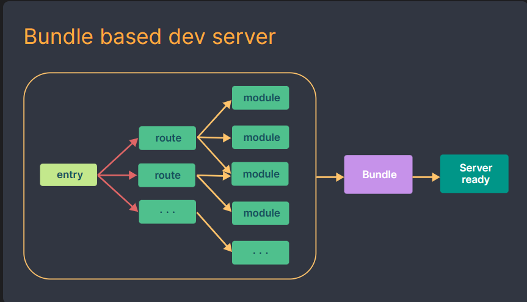
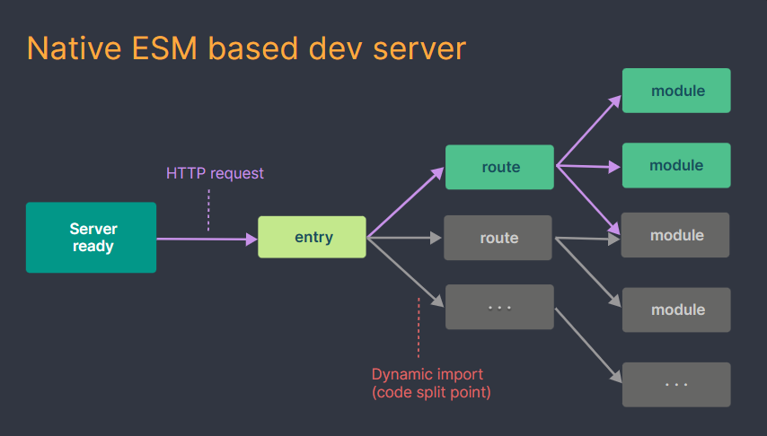

# vue_test3

## Project setup
```
npm install
```

### Compiles and hot-reloads for development
```
npm run serve
```

### Compiles and minifies for production
```
npm run build
```

### Lints and fixes files
```
npm run lint
```

### Customize configuration
See [Configuration Reference](https://cli.vuejs.org/config/).


# 创建 Vue3 工程

## 1. 使用 `vue-cli` 创建

官方文档: https://cli.vuejs.org/zh/guide/creating-a-project.html#vue-create

```shell
## 查看@vue/cli版本，确保@vue/cli版本在4.5.0以上
vue --version
## 安装或者升级你的@vue/cli
npm install -g @vue/cli
## 创建
vue create vue_test
## 启动
cd vue_test
npm run serve
```

## 使用 vite 创建

官方文档: https://v3.cn.vuejs.org/guide/installation.html#vite

vite官网: https://vitejs.cn

- 什么是 vite: 新一代前端构建工具;
- 优势如下: 
    - 开发环境中，无需打包操作，可以快速冷启动;
    - 轻量快速的热重载(HMR);
    - 真正的按需编译，不再等待整个应用编译完成;

传统构建与 vite 构建对比图






```shell
## 创建工程
npm init vite-app <project-name>
## 进入工程目录
cd <project-name>
## 安装依赖
npm install
## 运行
npm run dev
```


# 常用 `Composition API`

官方文档: https://v3.cn.vuejs.org/guide/composition-api-introduction.html

## 1. `setup` 函数

1. 理解: Vue3.0 中一个新的配置项，值为一个函数;
2. `setup` 是所有 `Composition Api` (组合API) "表演的舞台";
3. 组件中所有用到的: 数据(data), 方法(methods)等，均要配置在 `setup` 中;
4. `setup` 函数的两种返回值:
    - 对象: 对象中的属性、方法，在模板中均可以直接使用;
    - 函数(渲染函数): 可以自定义渲染内容;
5. 注意点:
    - 尽量不要与 `Vue2.x` 配混用;
        - 在 `Vue2.x` 配置 (`data`, `methods`, `computed`...) 中可以访问到 `setup` 中的属性、方法; (vue2的配置可以读取到vue3的配置)
        - 在 `setup` 中，不能访问到 `Vue2.x` 配置 (`data`,`methods`,`computed`...); 
        - 如果有重名 (例如: `data` 中配置了 `name`, `setup` 中也配置了 `name`), 优先使用 `setup` 中的数据;
    - `setup` 不能是一个 `async` 函数，因为返回值不再是 return 对象，而是 `promise`, 模板看不到 `return` 对象中的属性。(后期也可以返回一个 `Promise` 实例，但需要 `Suspense` 和 异步组件的配合)


## 2. `ref` 函数

1. 作用: 定义一个响应式数据；
2. 语法: `const name = ref('zhangsan')`
    - 创建一个包含响应式数据的 **引用对象** (`reference` 对象，简称 `ref` 对象);
    - JS中操作数据: `name.value='lisi'`;
    - 模板中读取数据: 不需要 `name.value` 直接: `<div>{{ name }}</div>`

备注: 
    - 接收的数据可以是: 基本类型，也可以是对象类型；
    - 基本类型的数据: 响应式依然是依靠 `Object.defineProperty()` 的 `get` 和 `set` 完成;
    - 对象类型的数据: 内部 借助了 `Vue3.0` 中的一个新函数 -- `reactive` 函数;

## 3. `reactive` 函数

1. 作用: 定义一个 对象类型 的响应式数据 (基本类型不要用它，要用 ref 函数)
2. 语法: `const 代理对象 = reactive( 源对象 )` 接收一个对象 (或数组)，返回一个 **代理对象** ( `Proxy` 的实例对象，简称 `proxy` 对象);
3. `reactive` 定义的响应式数据是 深层次的 (如果属性是一个对象，属性内部的属性变更也可以监听到);
4. 内部基于 ES6 的 `Proxy` 实现，通过代理对象操作源对象内部数据进行操作;


## 4. `Vue3.0` 中响应式的原理

### 1. `vue2.x` 的响应式

1. 实现原理:
    - 对象类型: 通过 `Object.defineProperty()` 对属性的 读取(`get`)、修改(`set`) 进行拦截 (数据劫持);
    - 数组类型: 通过 重写 更新数组的一系列方法来拦截。（对数组的变更方法进行了包裹）
    ```js
    Object.defineProperty(person, 'sex', {
        get() {...},
        set() {...}
    })
    ```
2. 存在的问题:
    - 新增属性、删除属性，界面不会更新; (因为只拦截了 get/set)
    - 直接通过下标修改数组的内容，页面不会更新 (因为是通过重写数组的相关函数实现)。

[vue2.x监测数据改变的原理](../vue_basic/12.列表渲染/10.总结Vue数据监测.html)

### 2. `vue3.0` 的响应式

实现原理:
    - 通过 `Proxy` (代理): 拦截对象中任意属性的变化，包括: 属性值的读/写 (`get/set`)、属性的添加 ( 也是通过 `set` 回调)、属性的删除 (`deleteProperty`)等;
    - 通过 `Reflect` (反射): 对源对象的属性操作;
    - MDN 文档中描述的 `Proxy` 和 `Reflect`
        - `Proxy`: https://developer.mozilla.org/zh-CN/docs/Web/JavaScript/Reference/Global_Objects/Proxy
        - `Reflect`: https://developer.mozilla.org/zh-CN/docs/Web/JavaScript/Reference/Global_Objects/Reflect

```js
let person = {name:'zhangsan', age:20};

new Proxy(person, {
    
    /**
     * 拦截获取属性的操作
     * @param target: 源对象，这里为 person
     * @param prop: 当前 get 操作对应的属性名称
     * */
    get(target, prop) {
        console.log(`拦截了 person 对象的 ${prop} 属性的 get操作`)
        // 直接通过对象获取属性
        // return target[prop];
        
        // 通过 Reflect 获取属性 （推荐）
        return Reflect.get(target, prop);
    },

    /**
     * 拦截修改属性 / 新增属性 的操作
     * */
    set(target, prop, value){
        console.log(`拦截了 person 对象的 ${prop} 属性的 set/add 操作`);
        // 直接通过对象设置
        // return target.set(prop, value)

        // 通过 Reflect 更新属性
        return Reflect.set(target, prop, value)
    },

    // 拦截删除属性的操作
    deleteProperty(target, prop) {
        console.log(`拦截了 person 对象的 ${prop} 属性的 删除 操作`);
        // return delete target[prop]
        return Reflect.deleteProperty(target, prop);
    }
})
```

## 5. `reactive` 对比 `ref`

1. 从定义数据的角度对比:
    - `ref`用来定义: 基本类型数据;
    - `reactive` 用来定义: 对象 (或数组) 类型数据;
    - 备注: `ref` 也可以用来定义 对象 (或数组) 类型数据，它内部会自动通过 `reactive` 转为代理对象;
2. 从原理角度对比:
    - `ref`: 通过 `Object.defineProperty()` 的 `get` 和 `set` 来实现响应式（数据劫持）;
    - `reactive`: 通过使用 `Proxy` 来实现响应式 (数据劫持)，并通过 `Reflect` 操作 源对象 内部的数据;
3. 从使用角度对比:
    - `ref` 定义的数据: 操作数据需要 `.value`, 读取数据时，模板中直接读取不需要 `.value`;
    - `reactive` 定义的数据: 操作数据与读取数据均不需要 `.value`;

## 6. `setup` 的两个注意点

- `setup` 的执行时机
    - 在 `beforeCreate()` 之前执行一次，`this` 是 `undefined`;
- `setup` 的参数
    - `props`: 值为对象，包含: 组件外部传递过来，但是没有在 `props` 配置中声明的属性，相当于 `this.$attrs`.
    - `slots`: 收到的插槽内容，相当于 `this.$slots`.
    - `emit`: 分发自定义事件的函数，相当于 `this.$emit`;

## 7. 计算属性与监视属性

### 计算属性 `computed` 函数

与 `vue2.x` 中的 `computed` 配置功能一致，写法如下:
```js
// 1. 导入计算属性
import { reactive, computed } from "vue";

// 2. 使用计算属性
let person = reactive({
    firstName: "zhang",
    lastName: "san",
});

// 声明一个计算属性
// let fullName = computed(() => {
//   return person.firstName + "-" + person.lastName;
// });

  // 声明计算属性，然后直接给 person 增加一个属性 (简写方式，只有get)
/*
person.fullName = computed(() => {
    return person.firstName + "-" + person.lastName;
});
*/

// 声明计算属性，然后直接给 person 增加一个属性 (完整写法，get/set)
person.fullName = computed({
    get() {
        return person.firstName + "-" + person.lastName;
    },
    set(value) {
        const arr = value.split("-");
        person.firstName = arr[0];
        person.lastName = arr[1];
    },
});
```

### 2. 监视属性 `watch` 函数

- 与 `vue2.x` 中 `watch` 配置功能一致;
- 两个小 "坑":
    - 监视 `reactive` 定义的响应式数据时: `oldValue` 无法正确获取、强制开启了深度监视 (`deep`配置无效);
    - 监视 `reactive` 定义的响应式数据中某个属性时: `deep` 配置有效;  

监视 ref 响应式数据
```js
let sum = ref(0);
let msg = ref("hello");

// 情况1: 监视 ref 所定义的的 一个 响应式数据
/*
watch(
    sum,
    (newValue, oldValue) => {
    console.log(
        `响应式数据 sum 变更了, oldValue=${oldValue}, newValue=${newValue}.`
    );
    },
    { immediate: true } // 支持传入第三个参数，配置监视属性: immediate:true 表示一加载就执行
);
*/

// 情况2: ref 所定义的 多个 响应式数据
// 1. 监视对象使用数组传入
// 2. 函数的参数 newValue, oldValue 也为为数组，每个index对应的属性与传入的顺序一致
// 这里的多个是指一个 watch 监视多个，当然也可以使用 多个watch，每个watch监视一个属性
watch(
    [sum, msg],
    (newValue, oldValue) => {
    // oldValue=[0, 'hello']
    // newValue=[1, 'hello']
    console.log(
        "响应式数据 sum 或 msg 变更了, oldValue=",
        oldValue,
        ", newValue=",
        newValue
    );
    },
    { immediate: true }
);
```

监视 reactive 响应式数据:
```js
let job = reactive({
    type: "开发",
    salary: 30,
    members: {
    count: 5,
    info: {
        age: 2,
    },
    },
});

// 情况3: 监视 reactive 所定义的一个响应式数据的 全部属性
// 注意:
// 1. 此处无法正确的获取 oldValue
// 2. 强制开启了深度监视 (deep配置无效了)，即: job.members.count 发生变化也能被监视到
/* 
watch(
    job,
    (newValue, oldValue) => {
    // 这里不能正确的获取到 oldValue
    // newValue=oldValue=Proxy(Object) {"type":"开发","salary":30,"members":{"count":6,"info":{"age":2}}}
    console.log(
        "reactive job 数据发生了变更, oldValue=",
        JSON.stringify(oldValue),
        ",  newValue=",
        JSON.stringify(newValue)
    );
    },
    // 此处的 deep:false 配置无效
    { immediate: true, deep: false }
);
*/

// 情况4: 监视 reactive 所定义的一个响应式数据中的某个属性
// 这里的 oldValue 能够正常返回
/*
watch(
    () => job.type,
    (newValue, oldValue) => {
    // reactvie job.type 数据发生了变更, oldValue=开发^, newValue=开发^^.
    console.log(
        `reactvie job.type 数据发生了变更, oldValue=${oldValue}, newValue=${newValue}.`
    );
    }
);
*/

// 情况5: 监视 reactive 所定义的一个响应式数据的某些属性
watch([() => job.type, () => job.members.count], (newValue, oldValue) => {
    // 同样，这里的 oldValue 也能成功的获取到
    // oldValue=['开发^', 5]
    // newValue=['开发^', 6]
    console.log(
    `reactvie job.type 或 job.members.count 数据发生了变更, oldValue=${oldValue}, newValue=${newValue}.`
    );
});

// 特殊情况
watch(
    () => job.members,
    (newValue, oldValue) => {
    console.log("reactive job.members 发生了变更", oldValue, newValue);
    },
    // 由于此处监视的是 reactive 所定义的某个属性，所以 deep 配置有效
    { deep: true }
);
```

watch监视ref数据的说明
```js
let sum = ref(0);
let msg = ref("hello");
// 这里使用 ref 创建的响应式数据是一个对象，refImpl 底层会通过 reactive 创建一个 proxy 对象作为 value
// RefImpl.value = Proxy()
let person = ref({
    name: "admin",
    age: 10,
});

// 对于基本类型数据 RefImpl.value = 具体值
// 这里 相当于 监视 RemImpl 对象，其属性 value 发生变更后，可以被监视到
watch(
    sum,
    (newValue, oldValue) => {
    console.log(
        `sum 数据发生了变更, oldValue=${oldValue}, newValue=${newValue}.`
    );
    },
    { immediate: true }
);

console.log("person=", person);

// 对于对象类型数据 RefImpl.value = Proxy() 底层会调用 reactive 创建
// 这里相当于监视 RefImpl 对象，默认情况下，只有 Proxy() 对象被替换后，才会触发监视属性
// 可以通过如下两种方案监视 Proxy() 中属性的变更

// 方案1: 直接监视 Proxy() 对象
/*
watch(person.value, (newValue, oldValue) => {
    // 同样，这里的 oldValue 也不能正确的获取到数据
    // person 对象的属性发生了变更, Proxy(Object) {name: 'admin^^', age: 10} Proxy(Object) {name: 'admin^^', age: 10}
    console.log("person 对象的属性发生了变更,", oldValue, newValue);
});
*/

// 方案2: 开启深度监视
watch(
    person,
    (newValue, oldValue) => {
    // 同样，这里的 oldValue 也不能正确的获取到数据
    // person 对象的属性发生了变更, Proxy(Object) {name: 'admin^^', age: 10} Proxy(Object) {name: 'admin^^', age: 10}
    console.log("person 对象的属性发生了变更,", oldValue, newValue);
    },
    { deep: true }
);
```


### 3. `watchEffect` 函数

- `watch` 的套路是: 既要指明监视的属性，也要指明监视的回调;
- `watchEffect` 的套路是: 不用指明监视哪个属性，监视的回调中用到了哪个属性，就监视哪个属性;
- `watchEffect` 有点像 `computed`:
    - 但 `computed` 注重的计算出来的值 （回调函数的返回值），所以必须要写返回值;
    - 而 `watchEffect` 更注重的是过程 (回调函数的函数体)，所以不用写返回值;
```js
// watchEffect 所指定的回调中用到的数据只要发生变化，则直接重新执行回调;
watchEffect(() => {
    // 使用到了sum
    const a = sum.value;
    // 这里 job 对象里面的其它字段变更，不会回调这个函数
    const b = job.members.count;
    console.log("watchEffect() 所指定的回调执行了");
});
```

## 8. 生命周期

- `Vue2`生命周期


- `Vue3`生命周期


- `Vue3` 中可以继续使用 `Vue2`中的生命周期钩子，但是有两个被更名；
    1. `beforeDestroy()  ->  beforeUnmount()`
    2. `destroyed()  ->  unmounted()`
- `Vue3` 也提供了 `Composition API` 形式的生命周期钩子, 与 `Vue2` 中钩子的对应关系如下:
    - `beforeCreate  ->  setup()`
    - `created  ->  setup()`
    - `beforeMount  ->  onBeforeMount()`
    - `mounted  ->  onMounted()`
    - `beforeUpdate  ->  onBeforeUpdate()`
    - `updated  ->  onUpdated()`
    - `beforeDestroy 不再触发` -> `beforeUnmount  ->  onBeforeUnmount()`
    - `destroy 不再触发` -> `unmounted  ->  onUnmounted()`

备注:
1. `Vue2` 中的钩子，在 `Vue3` 中也可以使用;
2. 如果组合`API` 跟 `vue2` 的生命周期钩子重复了，则 两个生命周期钩子都会执行，且组合`API` 会优先执行;

```js
// 回调顺序如下:
perfrom setup() // 组合式api回调
perfrom vue2 created.
perfrom vue2 beforeCreate.
perfrom api onBeforeMount   // 组合式api回调
perfrom vue2 beforeMount.
perfrom api onMounted   // 组合式api回调
perfrom vue2 mounted.
perfrom api onBeforeUpdate  // 组合式api回调
perform vue2 beforeUdpate
perfrom api onUpdated   // 组合式api回调
perform vue2 updated
perfrom api onBeforeUnmount // 组合式api回调
perform vue2 beforeUnmount
perfrom api onUnmounted // 组合式api回调
perform vue2 unmounted
```

## 9. 自定义 `hook` 函数

> 什么是 `hook`?

本质是一个函数，把 `setup` 函数中使用的 `Componsition API` 进行了封装; (将用到的数据，函数，生命周期钩子统一放到一个js的函数中)

类似于 `vue2` 中的 `mixin`;

优势: 复用代码，让 `setup` 中的逻辑简化，易懂;
    

## 10. `toRef` 和 `toRefs` 函数

1. 作用: 创建一个 `ref` 对象，其 `value` 值指向另一个对象中的某个属性;
2. 语法: `const name = toRef(person, 'name)` 、`const x = toRefs(person)`; 
3. 应用: 要将响应式数据中的一个 或 几个 属性单独提供给外部使用时;
4. 扩展: `toRefs` 与 `toRef` 功能一致，但是可以批量创建多个 `ref` 对象; (注意: `toRefs` 只能解析一层对象)


# 3. 其它 `Composition API`

## 1. `shallowReactive` 与 `shallowRef`

- `shallowReactive`: 只处理对象最外层属性的响应式 （浅响应式）;
- `shallowRef`: 只处理基本数据类型的响应式，不进行对象的响应式处理;

> 什么时候用?

- 如果有一个对象数据，结构比较深，但变化时，只是外层属性变化 --> `shallowReactive`
- 如果有一个对象数据，后续功能不会修改对象中的属性，而是创建新的对象来应用 --> `shallowRef`


