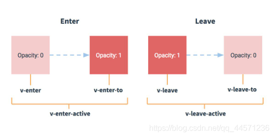

[toc]

# 如何安装脚手架

官网文档: https://cli.vuejs.org/zh/

1. 如果是首次使用，需要安装全局 @vue/cli
    `npm install -g @vue/cli`
2. 切换到工作目录，使用如下命令创建项目
    `vue create xxx`
3. 启动项目
    `npm run serve`

注意: 如果下载缓慢可以修改下载镜像，命令如下:
    `npm config set registry https://registry.npm.taobao.org`


# 脚手架项目结构

```
├── node_modules 
├── public
│   ├── favicon.ico: 页签图标
│   └── index.html: 主页面
├── src
│   ├── assets: 存放静态资源
│   │   └── logo.png
│   │── component: 存放组件
│   │   └── HelloWorld.vue
│   │── App.vue: 汇总所有组件
│   │── main.js: 入口文件
├── .gitignore: git版本管制忽略的配置
├── babel.config.js: babel的配置文件
├── package.json: 应用包配置文件 
├── README.md: 应用描述文件
├── package-lock.json：包版本控制文件

```

# 关于不同版本的 vue

1. vue.js 与 vue.runtime.xxx.js 的区别
    1. vue.js 是完整版的 vue， 包含: 核心功能 + 模板解析器
    2. vue.runtime.xxx.js 是运行版本的 vue，只包含 核心功能， 没有模板解析器
2. 因为 vue.runtime.xxx.js 没有模板解析器，所以不能使用 template 这个配置项，需要使用 render 函数接收到的 createElement 函数去指定具体内容;


# vue.config.js 配置文件

1. 使用 `vue inspect > output.js` 可以查看到 Vue 脚手架的默认配置;
2. 使用 vue.config.js 配置文件可以对脚手架进行个性化配置，详见: https://cli.vuejs.org/zh

# ref 属性

1. 被用来给 元素 或 子组件 注册引用信息 (id 的代替者);
2. 应用在 html 标签上获取的是真实 DOM 元素，应用在组件标签上，获取的是对应标签的组件对象 (vc);
3. 使用方式:
    - 添加 ref 标识 `<h2 ref="xxx">...</h2>` 或 `<School ref="xxx"></School>`
    - 获取 `this.$ref.xxx`

# props 配置项

1. 功能: 让组件接收外部传过来的数据
2. 传递数据: `<Student name="xxx" :age="20"></Student>`
3. 接收数据
    1. 第一种方式 (只接收数据): `props:["name", "age"]`
    2. 第二种方式 (限制接收的数据类型): `props: {name:String, age:Number}`
    3. 第三种方式 (限制类型，限制必要性，指定默认值)
    ```js
    data(){
        return {
            // 1. data 中定义的属性名称不能和 props 中的相同
            // 2. props 中的数据会在 data 数据之前被加载，因此可以使用 props 中的数据给 data 中的字段赋值
            // 3. props 中的数据是只读的，可以将 props 中的数据 赋值给 data，然后使用data中的数据去显示和操作
            showName:this.name
        }
    }
    props: {
        name: {
            type:String,    // 限制类型为 String
            required: true, // 必要性 （是否必传）
            default:"zhangsan"  // 默认值
        },
        age: {
            type:Number,    // 限制类型为 String
            default: 20 // 默认值
        }
    }
    ```

备注: props 是只读的， Vue 底层会监测开发者对 props 的修改，如果进行了修改，会发出警告，若业务确实需要修改数据，则可以通过 复制 props 中的内容到 data 中，然后去修改 data 中的值;


# mixin （混入/混合）

1. 功能: 可以把多个组件共用的配置提取成一个混入对象
2. 使用方式:
    1. 定义混入
    ```js
    // xxx.js
    {
        // 组件引入混合后，data 中的属性 和 methods 中的函数会取并集
        // 如果引入混入的组件中的 data 中的元素和methods中的函数有冲突，则优先使用 组件中的冲突属性/函数
        data(){
            return {
                name:"zhangsan",
                age:20,
            }
        },
        methods:{
            showName(){
                ...
            }
        },
        mounted() {
            ....
            // 如果引入混入的组件中也定义了对应的生命周期函数 mounted()
            // 则: 两 mounted() 都会执行 （混入文件中的会先执行）
        }，
        ...
    }
    ```
    2. 使用混入
        - 全局使用: `Vue.mixin(xxx)`
        - 局部使用: `mixins:["xxx"]`


# 插件

1. 功能: 用于增强Vue
2. 本质: 包含 `install()` 方法的一个对象，`install()` 方法的第一个参数是 `Vue`，第二个以后的参数是插件使用者传递的数据。
3. 定义插件:
    ```js
    对象.install = function (Vue, options) {
        // 导入全局过滤器
        Vue.filter("mySlice", function (value) {
            return value.slice(0, 4)
        })

        // 添加全局指令
        Vue.directive("fbind", {
            //指令与元素成功绑定时（一上来）
            bind(element, binding) {
                element.value = binding.value
            },
            //指令所在元素被插入页面时
            inserted(element, binding) {
                element.focus()
            },
            //指令所在的模板被重新解析时
            update(element, binding) {
                element.value = binding.value
            }
        })

        // 定义混入
        Vue.mixin({
            data() {
                return {
                    x: 1,
                    y: 2,
                }
            }
        })

        // 给Vue原型上添加一个方法， (vm和vc就都能用了)
        Vue.prototype.hello = () => { alert('你好啊') }
    }
    ```
4. 使用插件: `Vue.use(plugins, options)`

# scoped样式

1. 作用: 让样式在局部生效，防止组件之间冲突
2. 写法: `<style scoped></style>`

# TodoList案例总结

## 组件化编码流程

1. 拆分静态组件: 组件要按照功能点拆分，命名不要与html元素冲突;
2. 实现动态组件: 考虑好数据存放的位置，数据是一个组件在用还是一些组件在用
    - 一个组件在用: 放在组件自身即可；
    - 一些组件在用: 放在他们共同的父组件上 (状态提升);
3. 实现交互: 从绑定事件开始;

## props 属性使用场景

1. 父组件 ==> 子组件 通信
2. 子组件 ==> 父组件 通信 （需要父组件先给一个回调函数）

## 使用 v-model 的一些注意点

v-model绑定的值**不能**是 props 传递过来的值，因为 props 是不可以修改的;

props 传递过来的是一个对象类型的值，修改对象中的属性时 Vue 不会报错，但是不推荐这样做;


# webStorage 浏览器本地存储

1. 存储的内容一般支持 5M 左右（不同浏览器可能不同）;
2. 浏览器端通过 `Window.localStorage` 或 `Window.sessionStorage` 属性来实现本地存储机制;
3. 相关API:
    - `xxxStorage.setItem('key', 'value')`: 该方法接收一个键和值作为参数，会把键值对添加到存储中，如果 `key` 已经存在，则会覆盖 `value` 值;
    - `xxxStorage.getItem('key')`: 该方法接收一个键名 (`key`) 作为参数，返回键名对应的值；
    - `xxxStorage.removeItem('key')`: 该方法接受一个键名 (`key`) 作为参数，会将该键名对应的 `key-value` 从存储中删除;
    - `xxxStorage.clear()`: 该方法会清空存储中的所有数据;
4. 备注:
    - `SessionStorage` 存储的内容会随着浏览器窗口的关闭而消失;
    - `LocalStorage` 存储的内容需要手动清除 （清空浏览器缓存 / 调用删除的API）才会消失;
    - `xxxStorage.getItem('key')` 如果存储中没有对应的 `key-value` 键值对，那么 `getItem()` 返回的是 `null`;
    - `JSON.parse(null)` 的返回值也是 `null`;
    - `xxxStorage.setItem('key', 'value')` 存储的键值对都是字符串，如果需要存储对象使用 `xxxStorage.setItem('key', JSON.stringify({...}))`;

# 组件的自定义事件

1. 一种组件间通信的方式，适用于: 子组件 ==> 父组件;
2. 使用场景: A是父组件，B是子组件，B想给A传数据，那么需要在 A 中给B绑定自定义事件 （事件的回调在 A 中）;
3. 绑定自定义事件:
    - 第一种方式: 给 `Student` 组件绑定 `testEvent` 事件，如果事件被触发，则会执行 `test()` 函数
        - 在父组件中 `<Student @testEvent="test" />` 或 `<Student v-on:testEvent="test" />` ;
        - 如果只要触发一次事件 `<Student @testEvent.once='test'/>` ;
    - 第二种方式: 在父组件的回调函数中绑定
    ```js
    // 给组件设置 ref 引用
    <Student ref="student" />

    // 在 mounted() 挂载回调函数中绑定事件, 事件能够执行多次
    this.$refs.student.$on('testEvent', this.test)

    // 在 mounted() 挂载回调函数中绑定事件，事件只会被触发一次
    this.$refs.student.$once('testEvent', this.test)
    ```
4. 触发自定义事件: `this.$emit('testEvent', 数据)`
5. 解绑自定义事件
```js
// 解绑单个事件
this.$off('testEvent')
// 解绑多个事件
this.$off(['testEvent', 'demo'])
// 解绑所有事件
this.$off()
```
6. 组件也可以绑定原生事件
```js
// 直接使用 click 会把 click 认为成是自定义事件
<Student @click="test" />

// 如果想用使用原生的 click 事件，需要使用 native 修饰符
<Student @click.native="test" />
```
7. 注意: 通过 `this.$refs.xxx.$on('testEvent', 数据)` 绑定自定义事件时，回调函数要么配置在 `methods` 中，要么使用箭头函数，否则 `this` 会指向 `vc` 子组件；


# 全局事件总线 (GlobalEventBus)

1. 一种组件间通信的方式，适用于 **任意组件间的通信**。
2. 安装全局事件总线:
    ```js
    new Vue({
        ...
        beforeCreate() {
            // 安装全局的事件总线， $bus 就是当前应用的 vm
            Vue.prototype.$bus = this
        },
        ...
    })
    ---
3. 适用事件总线:
    - 接收数据: A 组件想接收数据，则在 A组件中给 `$bus` 绑定自定义事件，事件的回调留在 A 组件自身;
    ```js
    ...
    mounted() {
        // 绑定自定义事件到全局事件总线
        // 事件名称: testEvent
        // 留在组件A的事件回调函数 test
        this.$bus.$on('testEvent', this.test)
    },
    ...
    methods: {
        // 回调函数
        test(data) {
            ...
        }，
    }
    ...
    ```
    - 提供数据的地方发送事件: `this.$bus.$on('testEvent', 数据)`;

4. 最好在 `beforeDestroy()` 钩子函数中，用 `$off('testEvent')` 解绑当前组件用到的事件;


# 消息订阅与发布 (pubsub)

1. 一种组件间通信的方式，适用于 **任意组件间通信**。
2. 使用步骤:
    1. 安装: `npm i pubsub-js`;
    2. 引入: `import pubsub from 'pubsub.js'`;
    3. 订阅数据: A 组件想接收数据，则在 A 组件中订阅消息，订阅的回调留在 A 组件自身
    ```js
    // 导入 pubsub 库
    import pubsub from 'pubsub.js'

    ... 
    mounted() {
        // 订阅 testEvent 消息，消息的回调函数为 test
        // 订阅后返回一个 id，可以保存在 this 对象(vc)中，解绑订阅时需要使用
        this.pid = pubsub.subscribe('testEvent', this.test)
    },
    beforeDestroy() {
        // 销毁之前解绑订阅
        pubsub.unsubscribe('testEvent', this.pid)
    }
    ...
    methods: {
        // 订阅消息的回调函数
        // 消息订阅 第一个参数返回的是 key 的名称，第二个参数开始才是数据
        test(msgName, value) {
            ....
        },
    }
    ...
    ```
3. 发布数据: `pubsub.publish('testEvent', 数据)`;
4. 最好在组件销毁之前 `beforeDestroy()` 回调函数中解绑订阅消息 `pubsub.unsubscribe('testEvent', this.pid)`;


# nextTick()

1. 语法: `this.$nextTick(回调函数)`
2. 作用: 在下一次DOM 更新结束后执行其指定的回调函数；
3. 什么时候用: 当改变数据后，要基于更新后的新 DOM 进行某些操作时，要在 `nextTick()` 所指定的回调函数中执行。


# Vue封装的过渡与动画

1. 作用: 在插入、更新或移除 DOM 元素时，在合适的时候给元素添加样式类名;
2. 图示: 
3. 写法:
    1. 准备好样式:
        - 元素进入的样式
            - `v-enter`: 进入的起点
            - `v-enter-active`: 进入的过程中
            - `v-enter-to`: 进入的终点
        - 元素离开的样式
            - `v-leave`: 离开的起点
            - `v-leave-active`: 离开过程中
            - `v-leave-to`: 离开的终点
    2. 使用 `<transition>` 标签包括要过渡的元素，并配置name属性
        ```js
        // 单个元素配置过渡
        // appear标签: 表示一进入就执行动画
        <transition name="hello" appear="true">
            <h1 v-show="is-show">hello</h1>
        </transition>

        // 多个元素配置过渡
        <transition-group name="hello-group">
            <h1 v-show="!is-show" key="1">你好啊</h1>
            <h1 v-show="is-show" key="2">hello</h1>
        </transition-group>
        ```
备注: 若有多个元素需要过渡，则需要使用 `<transition-group>` 标签，且每个元素都要指定 `key` 值;


# vue脚手架配置代理

1. 安装 axios: `npm i axios`；
2. axios 请求案例:
```js
 axios.get("http://localhost:8080/students").then(
        (response) => {
          // 请求成功的回调
          console.log(`query students success, ${response.data}`);
        },
        (error) => {
          // 请求失败的回调
          console.log(`query students failure, ${error.message}`);
        }
      );
```

## 配置方法1

在 `vue.config.js` 配置文件中增加如下配置:
```js
  devServer: {
    // 代理 host 为 http://localhost:5000 的请求
    // 配置后，代码中请求为 http://localhost:5000 域名的 直接改为 http://localhost:8080
    proxy: "http://localhost:5000"
  },
```
说明:
- 优点: 配置简单，请求资源时直接发给前端 (8080) 即可;
- 缺点: 不能配置多个代理，不能灵活的控制请求是否走代理;
- 工作方式: 若按照上述配置代理，当请求了前端不存在的资源时，那么该请求会转发给服务器(优先匹配前端资源, 优先匹配 http://localhost:8080 服务器资源);

## 配置方法2

在 `vue.config.js` 配置具体代理规则:

```js
module.exports = {
	devServer: {
      proxy: {
      '/api1': {// 匹配所有以 '/api1'开头的请求路径
        target: 'http://localhost:5000',// 代理目标的基础路径
        changeOrigin: true,
        pathRewrite: {'^/api1': ''}
      },
      '/api2': {// 匹配所有以 '/api2'开头的请求路径
        target: 'http://localhost:5001',// 代理目标的基础路径
        changeOrigin: true,
        pathRewrite: {'^/api2': ''}
      }
    }
  }
}
/*
   changeOrigin设置为true时，服务器收到的请求头中的host为：localhost:5000
   changeOrigin设置为false时，服务器收到的请求头中的host为：localhost:8080
   changeOrigin默认值为true
*/
```
说明:
- 优点: 可以配置多个代理，且可以灵活的控制请求是否走代理;
- 缺点: 配置略微繁琐，请求资源时必须加前缀;


# 插槽

1. 作用: 让父组件可以向子组件指定位置插入 html 结构，也是一种组件间通信的方式，适用于 父组件 ==> 子组件;
2. 分类: 默认插槽、具名插槽、作用域插槽;
3. 使用方式
    1. 默认插槽:
        ```js
        // 父组件中:
        <Category>
            <div>html结构1</div>
        </Category>

        // 子组件中:
        <template>
            <div>
                <!-- 定义插槽 -->
                <slot>插槽默认显示的内容</slot>
            </div>
        </template>
        ```
    2. 具名插槽：
        ```js
        // 父组件中:
        <Category>
            <!-- 向 name=id1 的插槽插入html内容 -->
            <template slot="id1" >
                <div>html结构1</div>
            </template>

            <!-- 向 name=id2 的插槽插入html内容 -->
             <template slot="id2" >
                <div>html结构2</div>
            </template>
        </Category>

        // 子组件中:
        <template>
            <div>
                <!-- 定义插槽，指定name -->
                <slot name="id1">name=id1 插槽默认显示的内容</slot>
                <slot name="id2">name=id2 插槽默认显示的内容</slot>
            </div>
        </template>
        ```
    3. 作用域插槽:
        - 理解: 数据在子组件自身，但根据数据生成的结构需要组件使用者 (父组件) 来决定。
        - 具体编码:
        ```js
        // 父组件中：
		<Category>
            <!--
                这里 scope 的名称可以随便定义，scope 对应的值为 {"games":...}
            -->
			<template scope="scopeData">
				<!-- 生成的是ul列表 -->
				<ul>
					<li v-for="g in scopeData.games" :key="g">{{g}}</li>
				</ul>
			</template>
		</Category>

		<Category>
			<template slot-scope="scopeData">
				<!-- 生成的是h4标题 -->
				<h4 v-for="g in scopeData.games" :key="g">{{g}}</h4>
			</template>
		</Category>

        // 子组件中：
        <template>
            <div>
                <!-- 这里将子组件的 this.games 数据通过 games 名称传递给父组件中使用 -->
                <slot :games="games"></slot>
            </div>
        </template>
		
        <script>
            export default {
                name:'Category',
                props:['title'],
                //数据在子组件自身
                data() {
                    return {
                        games:['红色警戒','穿越火线','劲舞团','超级玛丽']
                    }
                },
            }
        </script>
        ```


# Vuex

1. 概念
    在 Vue 中实现集中式状态（数据）管理的一个 Vue 插件，对 Vue 应用中多个组件的共享状态进行集中式的管理（读/写），也是一种组件间通信的方式，且适用于任意组件间通信。
    
    

2. 何时使用: 多个组件需要共享数据时。
3. 搭建 Vuex 环境
    1. 安装 vuex 插件
    `vue` 和 `vuex` 插件版本关系:
    - `vue2 --> vuex3`
    - `vue3  --> vuex4`  
    
    使用命令 `npm i vuex` 安装的是最新版本 `vuex4`；
    使用 `npm i vuex@3` 安装 `vuex3` 版本;
    

    2. 创建文件: `src/store/index.js`
    ```js
    // 引入 Vue 核心
    import Vue from 'vue'
    // 引入 Vuex
    import Vuex from 'vuex'
    
    // 应用 Vuex 插件
    Vue.use(Vuex)

    // 准备 actions 对象 -- 响应组件中用户的动作
    const actions = {}
    // 准备 mutations 对象 -- 修改 state 中的数据
    const mutations = {}
    // 准备 state 对象 -- 保存具体的数据
    const state = {}

    // 创建并暴露 store
    export default new Vuex.Store({
        // actions:actions,
        // mutations:mutations,
        // state:state
        // 简写
        actions,
        mutations,
        state,
    })
    ```

    3. 在 `main.js` 中创建 `vm` 时传入 `store` 配置项
    ```js
    ...
    // import store from './store/index.js'
    // 如果导入的是目录下的 index.js 可以简写如下
    import store from './store'
    ...

    // 创建 vm
    new Vue({
        el:'#app',
        render: h=>h(App),
        // store:store,
        // key-value 相同简写如下
        store,
    })
    ```

4. 基本使用
    1. 初始化数据: 配置 actions，mutations，操作文件 store/index.js
    ```js
    // 该文件用于创建 Vuex 中最为核心的 store
    ... 文件导入参考上面

    // 准备 actions -- 用于响应组件中的动作
    const actions = {
        // 参数1: vuex 上下文
        // 参数2: 组件传递过来的参数
        // increament: function (context, value) {
        //     console.log("perform vuex actions, increament")
        // },
        // 加法操作，简写方式
        increament(context, value) {
            console.log('perfrom vuex actions increament, context=', context, ', value=', value);
            // 这里的 this 是 Store，代理了 state 对象，可以直接取 state 中的数据
            console.log('perfrom vuex actions increament, this=', this);
            // 将动作传递个 mutations 执行数据操作
            context.commit('INCREAMENT', value);
        },
        ...
        // sum 为奇数再执行加法
        increamentOdd(context, value) {
            console.log('perfrom vuex actions increamentOdd, context=', context, ', value=', value);
            if (state.sum % 2) {
                // 奇数进来，加法操作分发给之前写好的 actions
                // this.dispatch("increament", value);
                context.dispatch("increament", value);
            }
        },
        ...
    }

    // 准备 mutations -- 用于操作数据 (state)
    const mutations = {
        // 参数参考 actions
        // mutations 中的函数名称通常为 actions 中的大写
        INCREAMENT(context, value) {
            console.log("perfrom vuex mutations INCREAMENT, context=", context, ",value=", value);
            // 这里的 this 是 Store，代理了 state 对象，可以直接取 state 中的数据
            console.log("perfrom vuex mutations INCREAMENT, this=", this);
            // 操作数据，数据变更后 vue 会重新解析模板(刷新页面)
            state.sum += value;
        },

        DECREAMENT(context, value) {
            console.log("perfrom vuex mutations DECREAMENT, context=", context, ",value=", value);
            state.sum -= value;
        }
    }

    // 准备 state -- 用于存储数据
    const state = {
        // 将 求和操作的数据值放到 store.state 中保存
        sum: 0,
    }

    ... Vuex.Store 对象创建参考上面
    ```
    2. 组件中读取 vuex 中的数据: `$store.state.sum`
    3. 组件中修改 vuex 中的数据 :
        - 方案1: `$store.dispatch('action中的方法名', params)`  --> 标准使用方式
        - 方案2: `$store.commit('mutations中的方法名', params)` --> 绕过 `actions` 直接执行 `mutations`
        
    备注: 若没有网络请求或其它业务逻辑，组件中也可以绕过 actions，即 上述方案2;

4. `getters` 的使用
    1. 概念: 当 `state` 中的数据需要经过加工后再使用时，可以使用 `getters` 加工;
    2. 在 `store/index.js` 中追加 `getters` 配置
    ```js
    ...
    // 准备 getters 对象，用于对 state 数据进行加工
    const getters = {
        bigSum(state){
            return state.sum * 10
        }
    }
    ...

    // 创建并暴露store
    export default new Vuex.Store({
        ...
        // 配置 getters 到 store中
        getters,
    })
    ```
    3. 组件中使用: `$store.getters.bigSum`

6. 四个map方法的使用

    1. `mapState`方法: 用于帮助映射 `$store.state` 中的数据，为计算属性
    ```js
    ...
    import {mapState} from 'vuex'
    ...
    computed: {
        // 借助 mapState 生成计算属性: sum、school、subject (对象写法)
        // key: 组件中使用的名称
        // value: 为 $store.state 中字段的名称
        ...mapState({he:'sum', school:'school', subject:'subject'}),

        // 借助 mapState 生成计算属性: sum、school、subject （数组写法）
        ...mapState(['sum', 'school', 'subject']),
    }
    ```

    2. `mapGetters`方法: 用于帮助映射 `$store.gatters` 中的数据，为计算属性
    ```js
    import {mapState, mapGatters} from 'vuex'
    ...
    computed: {
        // 借助 mapGatters 生成计算属性: bigSum (对象写法)
        // key: 组件中使用的名称
        // value: 为 $store.gatters 中字段的名称
        ...mapGatters({bigSum:'bigSum'}),

        // 借助 mapGatters 生成计算属性: bigSum (数组写法)
        // key: 组件中使用的名称bigSum
        // value: 为 $store.gatters 中字段的名称
        ...mapGatters(['bigSum'])
    }
    ```

    3. `mapActions`方法: 用于帮助生成与 `$store.actions` 对话的方法，即: 包含 `$store.dispatch(xxx)` 的函数
    ```js
    import {mapActions} from 'vuex'
    ...
    methods: {
        // 通过 mapActions 生成: increament, decreament 函数 (对象写法)
        ...mapActions({increament:'increament', decreament:'decreament'}),

        // 通过 mapActions 生成: increament, decreament 函数 (数组写法)
        ...mapActions(['increament', 'decreament']),

        // 注意: 如果函数有使用到组件中的参数 (this.step)，则需要调用的地方传入参数
        // 原先写法: <button @click="increament()" />
        // 使用 mapActions 后: <button @click="increament(step)" />
    }
    ```

    4. `mapMutations` 方法: 用于帮助生成与 `mutations` 对话的方法，即: 包含 `$store.commit(xxx)` 的函数
    ```js
    import {mapMutations} from 'vuex'
    ...
    methods: {
        // 通过 mapMutations 生成 increament, decreament 函数 (对象写法)
        ...mapMutations({increament:'INCRAEMENT', decreament:'DECREAMENT'}),

        // 通过 mapMutations 生成 increament, decrement 函数 (数组)
        ...mapMutations(['INCRAEMENT', 'DECREAMENT']),

        // 注意: 如果函数有使用到组件中的参数 (this.step)，则需要调用的地方传入参数
        // 原先写法: <button @click="INCREAMENT()" />
        // 使用 mapActions 后: <button @click="INCREAMENT(step)" />
    }
    ```

备注: `mapActions` 与 `mapMutations` 使用时，若需要传递参数，则需要在 模板中绑定事件时传递好参数，否则参数是事件对象;

7. 模块化+命名空间

    1. 目的: 让代码更好维护，让多种数据分类更加明确;
    2. 修改 `store/index.js`
    ```js
    const countAbout = {
        namespaced: true,   // 开启命名空间
        state: { sum: 1, },
        mutations:{...},
        actions:{...},
        getters:{
            bigSum(state){
                retutn state.sum * 10;
            }
        }
    }

    const personAbout = {
        namespaced: true,   // 开启命名空间
        state: { personList:[{id:'001', name:'zhangsan'}]},
        mutations: {
            ADD_PERSON(context, value){
                // 添加person
            }
        },
        actions: {
            addPerson(context, value){
                // 添加person
            }
        },
        getters: {
            firstPerson(){
                return ...
            }
        }
    }

    const store = new Vuex.Store({
        mudules: {
            // countAbout: countAbout,
            countAbout,
            personAbout
        }
    })
    ```
    
    3. 开启命名空间后，组件中读取 `state` 数据:
    ```js
    // 方式1: 自己直接读取
    this.$store.state.personAbout.personList;

    // 方式二: 借助 mapState 读取
    ...mapState('countAbout', ['sum', 'school']);
    ``` 

    4. 开启命名空间后，组件中读取 `getters` 数据:
    ```js
    // 方式1: 自己直接读取
    this.$store.getters['personAbout/firstPerson']

    // 方式2: 借助 mapGetters 读取
    ...mapGetters('personAbout', ['firstPerson'])
    ```

    5. 开启命名空间后，组件中调用 `dispatch`
    ```js
    // 方式1: 自己直接 dispatch
    this.$store.dispatch('personAbout/addPerson', person);

    // 方式2: 借助 mapActions
    ...mapActions('countAbout', ['increment', 'decrement']);
    ```

    6. 开启命名空间后，组件中调用 `commit`
    ```js
    // 方式1: 自己直接commit
    this.$store.commit('personAbout/ADD_PERSON', person)

    // 方式2: 借助 mapMutations
    ...mapMutations('personAbout', [addPerson:'ADD_PERSON'])
    ```

# 路由

理解: 一个路由 (route) 就是一组映射关系 (key-value), 多个路由需要路由器 (router) 进行管理;

前端路由: key 是路径，value是组件;

## 1. 基本使用

1. 安装 `vue-router`, 命令: `npm i vue-router`;

上述命令安装的路由是最新版本，适用于 `vue3`，如果使用的是 `vue2` 则需要如下安装命令: `npm i vue-router@3`;

2. 导入并应用插件;
```js
// 导入 Vue
import Vue from 'vue';
// 导入插件
import VueRouter from 'vue-router';
// 使用插件
Vue.use(VueRouter);
```

3. 编写router配置项: `src/router/index.js`;
```js
// 引入router
import VueRouter from 'vue-router'
// 引入路由组件
import About from '../components/About'
import Home from '../components/Home'

// 创建 router 实例对象，去管理一组一组的路由规则
const router = new VueRouter({
    routes: [
        {
            path:'/about',
            component: About
        },
        {
            path:'/home',
            component: Home
        }
    ]
})

// 暴露 router
export default router
```

4. 实现切换 (`active-class` 可配置高亮样式)

`<router-link active-class="active" to="/about">About</router-link>`

5. 指定展示位置

`<router-view></router-view>`

## 2. 几个注意点

1. 路由组件通常存放在 `pages` 文件夹，一般组件通常存放在 `components` 文件夹;
2. 通过切换，"隐藏" 了的路由组件，默认是被销毁的，需要的时候再去挂载;
3. 每个组件都有自己的 `$router` 属性，里面存储着自己的路由信息;
4. 整个应用只有一个 `router`,可以通过组件的 `$router` 属性获取到;

## 3. 多级路由

1. 配置路由规则，使用 `children` 配置项;
```js
routes: [
    {
        path:'/about',
        component: About
    },
    {
        path:'/home',
        component: Home,
        children: [ // 通过 children 配置子级路由
            {
                path: 'news',   // 此处一定不要写: /news
                component: News
            },
            {
                path: 'message',    // 此处一定不要写: /message
                component: Message
            }
        ]
    }
]
```

2. 跳转 (要写完成路径)

`<router-link to="/home/news">News</router-link>`

## 4. 路由的 query 参数

1. 传递参数
```html
<!-- 跳转并携带 query 参数，to的字符串写法，参数固定 -->
<router-link to="/home/message/detail?id=666&title=你好">跳转</router-link>
<!-- 跳转并携带 query 参数，to的字符串写法，模板字符串 `` 动态传参 -->
<router-link :to="`/home/message/detail?id=${m.id}&title=${m.title}`">跳转</router-link>

<!-- 跳转并携带 query 参数，to的对象写法 -->
<router-link
    :to="{
        path:'/home/message/detail',
        query: {
            id:m.id,
            title:m.title
        }
    }"
>跳转</router-link>
```

2. 接收参数

```js
$router.query.id
$router.query.title
```

## 5. 命名路由

1. 作用: 可以简化路由的跳转。
2. 如何使用
    1. 给路由命名：
    ```js
    {
        path:'/demo',
        component: Demo,
        children: [
            {
                path:'test',
                component: Test,
                children: [
                    name: 'hello',  // 给路由命名
                    path: 'welcome',
                    component: Hello,
                ]
            }
        ]
    }
    ```
    
    2. 简化跳转
    ```html
    <!-- 简化前，需要写完整的路径 -->
    <router-link to="/demo/test/welcome">跳转</router-link>

    <!-- 简化后，直接通过名字跳转 -->
    <router-link :to="{name:'hello'}">跳转</router-link>

    <!-- 简化写法配合传递参数 -->
    <router-link
        :to="{
            name:'hello',
            query:{
                id:666,
                title:'你好'
            }
        }"
    >跳转</router-link>
    ```

## 6. 路由的 params 参数

1. 配置路由, 在路由配置文件 `src/router/index.js` 中声明接收 params 参数

```js
export default new VueRouter({
	routes: [
        ...
		{
			path: '/home',
			component: Home,
			children: [
				{
					path: 'news',   // 二级路由不要写 /news
					component: News,
				},
				{
					path: 'message',
					component: Message,
					children: [
						{
							name: 'to_detail',	// 给路由命名
							path: 'detail/:id/:title',	// 使用占位符声明接收 params 参数
							component: Detail,
						}
					]
				}
			]
		}
	]
})
```

2. 传递参数

```html
<!-- 跳转并携带 params 参数，to的字符串写法 -->
<router-link :to="/home/message/detail/666/nihao">跳转</router-link>
<!-- 跳转并携带 params 参数，to的模板字符串写法 -->
<router-link :to="`/home/message/detail/${msg.id}/${msg.title}`">跳转</router-link>

<!-- 跳转并携带 params 参数，to的对象写法 -->
<router-link :to="{
    name:'to_detail',
    params: {
        id:666,
        title:'nihao'
    }
}">跳转</router-link>
```

备注: 路由携带 `params` 参数时，若使用 to 的对象写法，则不能使用 path 配置项，必须使用 name 配置;

3. 接收参数

```js
$route.params.id
$route.params.title
```

## 7. 路由的 props 配置

作用: 让路由组件更方便的收到参数，配置如下:

```js
// 1. 路由配置
{
    name: 'to_detail',
    path: 'detail/:id/:title',
    component: Detail,

    // 第一种写法: props 值为对象，该对象中所有的 key-value 的组合最终都会通过 props 传递给 Detail 组件
    // props: {id: 666},

    // 第二种写法: props 值为 布尔值，布尔值为 true，则把路由收到的所有 params 参数通过 props 传递给 Detail 组件
    // props: true,

    // 第三种写法: props 值为 函数，该函数返回的对象中每一组 key-value 都会通过 props 传给 Detail 组件
    // 函数入参为 route 对象
    props(route) {
        return {
            id: route.query.id,
            title: route.query.title
        }
    },
}

// 2. 接收参数，在Detail组件中

// 在 props 属性中配置key
props:['id', 'title']
// 代码中直接使用
<li>消息id:{{id}}</li>
```


## 8 <router-link> 的 replace 属性

1. 作用: 控制路由跳转时，操作浏览器历史记录的模式;
2. 浏览器的历史记录有两种写入方式:
    - `push`: 追加历史记录; (路由跳转时，默认为 `push`)
    - `replace`: 替换当前记录;
3. 如何使用: 
```html
<!-- 使用 replace 属性设置路由跳转的 replace 模式 -->
<router-link :replace="true" ....>News</router-link>

<!-- 简写 -->
<router-link replace ....>News</router-link>
```

## 9. 编程式路由导航

1. 作用: 不借助 `<router-link>` 实现路由跳转，让路由跳转更加灵活;
2. 如何实现：
```js
// $router 的两个 API ($router 对象全局只有一个)
this.$router.push({
    name: 'to_detail',
    params: {
        id:666,
        title:'nihao',
    }
})

this.$router.replace({
    name: 'to_detail',
    params: {
        id: 666,
        title: 'nihao',
    }
})

// 前进
this.$router.forward()
// 后退
this.$router.back()
// 前进/后退指定页面    count>0前进 count<0后退
this.$router.go(count)
```

## 10. 缓存路由组件

1. 作用： 让不显示的路由组件保持挂载，不被销毁;
2. 编码实现:
```html
<!-- 缓存 <router-view> 上显示的所有组件 -->
<keep-alive>
    <router-view></router-view>
</keep-alive>

<!-- 
    只缓存 <router-view> 下的 News 组件， 
    注意: News 为组件名称 
    -->
<keep-alive include='News' >
    <router-view></router-view>
</keep-alive>

<!-- 缓存 <router-view> 上的多个组件 -->
<keep-alive :include="['News', 'Message']" >
    <router-view></router-view>
</keep-alive>
```

## 11. 两个新的生命周期钩子

1. 作用: 路由组件所独有的两个钩子，用于捕获路由组件的激活状态;
2. 具体名字:
    - `activated`: 路由组件被激活 (显示) 时触发;
    - `deactivated`: 路由组件失活 (隐藏) 时触发;


## 12. 路由守卫

1. 作用：对路由进行权限控制;
2. 分类: 全局守卫、独享守卫、组件内守卫;

### 全局守卫

```js
const router = new VueRouter({
    routes: [
        {
            path: '/home',
            component: Home,
            meta: {isAuth:true, title:'zhuye',...}    // meta 里面可以配置路由配置对象的自定义数据
        },
        ...
    ]
})

// 全局前置守卫: 初始化时执行、每次路由切换前执行
router.beforeEach((to, from, next)=>{
    console.log(`perfrom beforeEach, from=${from}, to=${to}, next=${next}.`)
    if (to.meta.isAuth) {
        // 判断路由是否配置了需要校验权限
        if (localStorage.getItem('account') === 'admin') {   // 判断本地缓存的账号是否是admin
            next(); // 调用 next() 表示向下执行路由跳转
        } else {
            alert('请先登录')
        }
    } else {
        // 不需要校验权限的直接跳转
        next();
    }
})

// 全局后置守卫: 初始化时执行、每次路由跳转后执行
router.afterEach((to, from) => {
    console.log(`perfrom afterEach, from=${from}, to=${to}.`)
    if (to.meta.title) {    // 如果路由配置了标题，则更新网页的title
        document.title = to.meta.title;
    } else {
        document.title = "默认标题";
    }
})
```

### 独享守卫


### 组件内守卫


