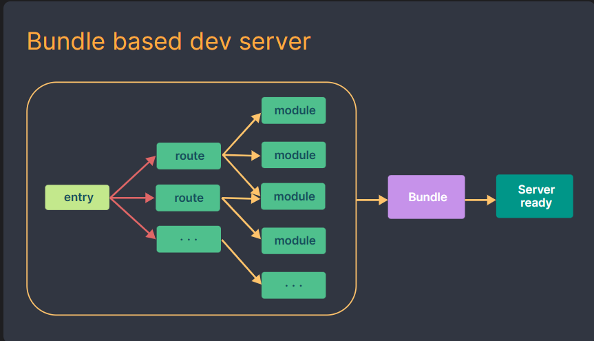
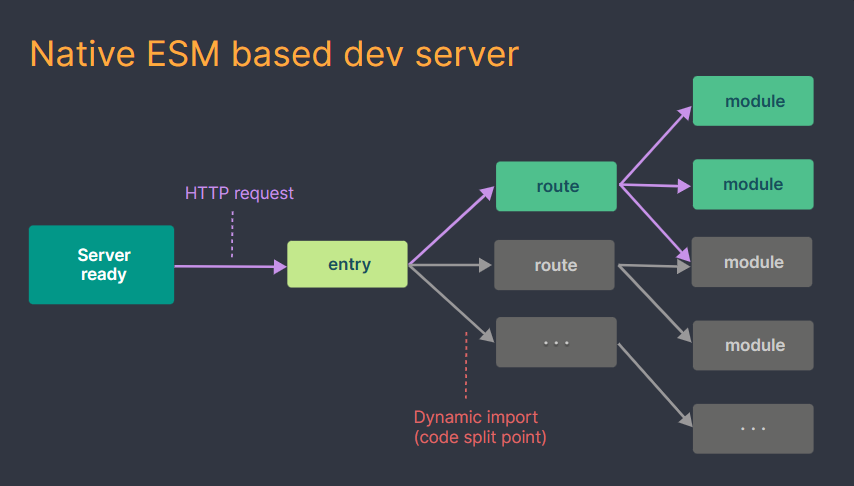

# vue_test3

## Project setup
```
npm install
```

### Compiles and hot-reloads for development
```
npm run serve
```

### Compiles and minifies for production
```
npm run build
```

### Lints and fixes files
```
npm run lint
```

### Customize configuration
See [Configuration Reference](https://cli.vuejs.org/config/).


# 创建 Vue3 工程

## 1. 使用 `vue-cli` 创建

官方文档: https://cli.vuejs.org/zh/guide/creating-a-project.html#vue-create

```shell
## 查看@vue/cli版本，确保@vue/cli版本在4.5.0以上
vue --version
## 安装或者升级你的@vue/cli
npm install -g @vue/cli
## 创建
vue create vue_test
## 启动
cd vue_test
npm run serve
```

## 使用 vite 创建

官方文档: https://v3.cn.vuejs.org/guide/installation.html#vite

vite官网: https://vitejs.cn

- 什么是 vite: 新一代前端构建工具;
- 优势如下: 
    - 开发环境中，无需打包操作，可以快速冷启动;
    - 轻量快速的热重载(HMR);
    - 真正的按需编译，不再等待整个应用编译完成;

传统构建与 vite 构建对比图






```shell
## 创建工程
npm init vite-app <project-name>
## 进入工程目录
cd <project-name>
## 安装依赖
npm install
## 运行
npm run dev
```


# 常用 `Composition API`

官方文档: https://v3.cn.vuejs.org/guide/composition-api-introduction.html

## 1. `setup` 函数

1. 理解: Vue3.0 中一个新的配置项，值为一个函数;
2. `setup` 是所有 `Composition Api` (组合API) "表演的舞台";
3. 组件中所有用到的: 数据(data), 方法(methods)等，均要配置在 `setup` 中;
4. `setup` 函数的两种返回值:
    - 对象: 对象中的属性、方法，在模板中均可以直接使用;
    - 函数(渲染函数): 可以自定义渲染内容;
5. 注意点:
    - 尽量不要与 `Vue2.x` 配混用;
        - 在 `Vue2.x` 配置 (`data`, `methods`, `computed`...) 中可以访问到 `setup` 中的属性、方法; (vue2的配置可以读取到vue3的配置)
        - 在 `setup` 中，不能访问到 `Vue2.x` 配置 (`data`,`methods`,`computed`...); 
        - 如果有重名 (例如: `data` 中配置了 `name`, `setup` 中也配置了 `name`), 优先使用 `setup` 中的数据;
    - `setup` 不能是一个 `async` 函数，因为返回值不再是 return 对象，而是 `promise`, 模板看不到 `return` 对象中的属性。(后期也可以返回一个 `Promise` 实例，但需要 `Suspense` 和 异步组件的配合)


## 2. `ref` 函数

1. 作用: 定义一个响应式数据；
2. 语法: `const name = ref('zhangsan')`
    - 创建一个包含响应式数据的 **引用对象** (`reference` 对象，简称 `ref` 对象);
    - JS中操作数据: `name.value='lisi'`;
    - 模板中读取数据: 不需要 `name.value` 直接: `<div>{{ name }}</div>`

备注: 
    - 接收的数据可以是: 基本类型，也可以是对象类型；
    - 基本类型的数据: 响应式依然是依靠 `Object.defineProperty()` 的 `get` 和 `set` 完成;
    - 对象类型的数据: 内部 借助了 `Vue3.0` 中的一个新函数 -- `reactive` 函数;

## 3. `reactive` 函数

1. 作用: 定义一个 对象类型 的响应式数据 (基本类型不要用它，要用 ref 函数)
2. 语法: `const 代理对象 = reactive( 源对象 )` 接收一个对象 (或数组)，返回一个 **代理对象** ( `Proxy` 的实例对象，简称 `proxy` 对象);
3. `reactive` 定义的响应式数据是 深层次的 (如果属性是一个对象，属性内部的属性变更也可以监听到);
4. 内部基于 ES6 的 `Proxy` 实现，通过代理对象操作源对象内部数据进行操作;


## 4. `Vue3.0` 中响应式的原理

### 1. `vue2.x` 的响应式

1. 实现原理:
    - 对象类型: 通过 `Object.defineProperty()` 对属性的 读取(`get`)、修改(`set`) 进行拦截 (数据劫持);
    - 数组类型: 通过 重写 更新数组的一系列方法来拦截。（对数组的变更方法进行了包裹）
    ```js
    Object.defineProperty(person, 'sex', {
        get() {...},
        set() {...}
    })
    ```
2. 存在的问题:
    - 新增属性、删除属性，界面不会更新; (因为只拦截了 get/set)
    - 直接通过下标修改数组的内容，页面不会更新 (因为是通过重写数组的相关函数实现)。

[vue2.x监测数据改变的原理](../vue_basic/12.列表渲染/10.总结Vue数据监测.html)

### 2. `vue3.0` 的响应式

实现原理:
    - 通过 `Proxy` (代理): 拦截对象中任意属性的变化，包括: 属性值的读/写 (`get/set`)、属性的添加 ( 也是通过 `set` 回调)、属性的删除 (`deleteProperty`)等;
    - 通过 `Reflect` (反射): 对源对象的属性操作;
    - MDN 文档中描述的 `Proxy` 和 `Reflect`
        - `Proxy`: https://developer.mozilla.org/zh-CN/docs/Web/JavaScript/Reference/Global_Objects/Proxy
        - `Reflect`: https://developer.mozilla.org/zh-CN/docs/Web/JavaScript/Reference/Global_Objects/Reflect

```js
let person = {name:'zhangsan', age:20};

new Proxy(person, {
    
    /**
     * 拦截获取属性的操作
     * @param target: 源对象，这里为 person
     * @param prop: 当前 get 操作对应的属性名称
     * */
    get(target, prop) {
        console.log(`拦截了 person 对象的 ${prop} 属性的 get操作`)
        // 直接通过对象获取属性
        // return target[prop];
        
        // 通过 Reflect 获取属性 （推荐）
        return Reflect.get(target, prop);
    },

    /**
     * 拦截修改属性 / 新增属性 的操作
     * */
    set(target, prop, value){
        console.log(`拦截了 person 对象的 ${prop} 属性的 set/add 操作`);
        // 直接通过对象设置
        // return target.set(prop, value)

        // 通过 Reflect 更新属性
        return Reflect.set(target, prop, value)
    },

    // 拦截删除属性的操作
    deleteProperty(target, prop) {
        console.log(`拦截了 person 对象的 ${prop} 属性的 删除 操作`);
        // return delete target[prop]
        return Reflect.deleteProperty(target, prop);
    }
})
```


